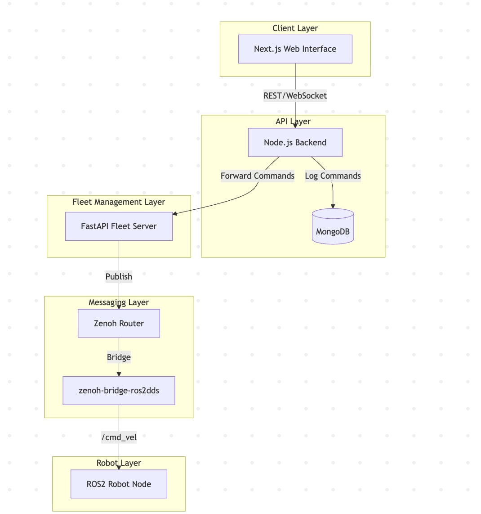

# Web Teleop Robot System

A web-based teleoperation system for robots using Next.js, Node.js, FastAPI, and Zenoh.

## 🏗️ System Overview



**Services:**
- **Frontend**: Web control interface (Next.js)
- **Backend API**: REST API and WebSocket (Node.js)
- **Fleet Server**: Robot communication (FastAPI + Zenoh)
- **Robot**: Simulated robot for testing (ROS2)
- **MongoDB**: Data persistence
- **Zenoh Bridge**: ROS2 integration

## 🚀 Quick Start

### Prerequisites
- Docker and Docker Compose
- Git

### Setup and Run
```bash
# 1. Clone and setup
git clone <repository-url>
cd teleop-robot
cp .env.example .env
chmod +x docker-cleanup-and-run.sh

# 2. Start all services (recommended)
./docker-cleanup-and-run.sh

# 3. Access the application
# Web Interface: http://localhost:3000
# Backend API: http://localhost:3001
```

### Alternative Commands
```bash
# Manual start (all services)
docker-compose up -d --build

# Start with robot simulation
docker-compose --profile robot up -d --build

# View logs
docker-compose logs -f

# Stop services
docker-compose down
```

## ⚙️ Configuration

Key environment variables in `.env`:
```bash
# Ports
WEB_PORT=3000
NODE_PORT=3001
FLEET_PORT=8000

# Robot Control
VX_MAX=2.0
VY_MAX=2.0

# Safety Features
DEADMAN_SWITCH_ENABLED=true
DEADMAN_SWITCH_TIMEOUT_MS=5000

# Authentication
AUTH_ENABLED=true
API_KEYS=test-api-key-123,admin-key-456
JWT_SECRET=your-secret-key-here
```

## 📡 API Endpoints

### Authentication
```bash
# Get JWT token
POST /api/auth/token
{
  "userId": "test-user",
  "scopes": ["robot:control"]
}

# Use API key
Authorization: ApiKey test-api-key-123

# Use JWT token
Authorization: Bearer <jwt-token>
```

### Robot Control
```bash
# Send velocity command
POST /api/vel
{
  "vx": 0.2,
  "vy": 0.1,
  "levels": {
    "up": 2,
    "down": 0,
    "left": 0,
    "right": 1
  }
}
```

### Health Checks
- `GET /health` - Backend health
- `GET /api/health` - API health
- `GET /status` - Fleet server status (port 8000)

## 🛡️ Safety Features

### Deadman Switch
Automatic safety system that stops the robot when connection is lost.

**How it works:**
- **Connection Loss**: Automatically sends `{vx: 0, vy: 0}` when WebSocket disconnects
- **Timeout Protection**: Stops robot if no activity for 5 seconds (configurable)
- **Error Handling**: Triggers on connection errors or network issues
- **UI Reset**: Frontend automatically resets to stopped state

**Configuration:**
```bash
DEADMAN_SWITCH_ENABLED=true
DEADMAN_SWITCH_TIMEOUT_MS=5000  # 5 seconds timeout
```

**Testing Deadman Switch:**
```bash
# 1. Start system and move robot
./docker-cleanup-and-run.sh
# Open http://localhost:3000 and press movement buttons

# 2. Test disconnect (choose one method):
# - Close browser tab
# - Disconnect network
# - Run: docker pause teleop-robot-web-1

# 3. Check logs for safety activation
docker-compose logs -f node-api | grep deadman
docker-compose logs -f robot | grep "velocity_x=0.0"
```

**Expected behavior:**
- ✅ Robot immediately stops (`velocity_x=0.0, velocity_y=0.0`)
- ✅ Backend logs show `deadman_switch_activated`
- ✅ Frontend shows "🛑 Robot stopped for safety"
- ✅ Database logs command with `source: deadman_switch`

## 🧪 Testing

### Manual Testing
```bash
# Test robot movement
curl -X POST http://localhost:3001/api/vel \
  -H "Authorization: ApiKey test-api-key-123" \
  -H "Content-Type: application/json" \
  -d '{"vx":0.5,"vy":0.2,"levels":{"up":5,"down":0,"left":0,"right":2}}'

# Test stop command
curl -X POST http://localhost:3001/api/vel \
  -H "Authorization: ApiKey test-api-key-123" \
  -H "Content-Type: application/json" \
  -d '{"vx":0,"vy":0,"levels":{"up":0,"down":0,"left":0,"right":0}}'

# Check logs
curl http://localhost:3001/api/logs?limit=10
```

### Automated Testing
```bash
# Run deadman switch tests
node test-deadman-switch.js

# Check all services health
curl http://localhost:3001/health
curl http://localhost:8000/status
```

## 🐛 Troubleshooting

### Common Issues
```bash
# Port conflicts
./docker-cleanup-and-run.sh

# Rebuild after config changes
docker-compose build --no-cache
docker-compose up -d

# Check service status
docker-compose ps
docker-compose logs -f <service-name>

# Clean everything
docker-compose down -v
docker system prune -a
```

### Service URLs
- **Web Interface**: http://localhost:3000
- **Backend API**: http://localhost:3001/health
- **Fleet API**: http://localhost:8000/status
- **MongoDB**: localhost:27017

### Specific Issues

**Deadman switch not working:**
```bash
# Check if enabled
grep DEADMAN_SWITCH .env

# Test manually
# 1. Move robot via web interface
# 2. Close browser tab  
# 3. Check logs: docker-compose logs node-api | grep deadman
# 4. Verify robot stopped: docker-compose logs robot | tail -5
```

**Robot not receiving commands:**
```bash
# Check service chain
docker-compose logs web | grep velocity     # Frontend
docker-compose logs node-api | grep vel     # Backend
docker-compose logs fleet-api | grep vel    # Fleet
docker-compose logs robot | grep velocity   # Robot

# Check Zenoh connection
docker-compose logs zenoh
docker-compose logs bridge
```

**Authentication errors:**
```bash
# Check API keys match across services
grep API_KEYS .env

# Test with curl
curl -H "Authorization: ApiKey test-api-key-123" \
     http://localhost:3001/api/health
```

## 🛠️ Development

### Local Development
```bash
# Install dependencies
npm install
npm run install:all

# Start in development mode
npm run dev
```

### Docker Development
```bash
# Restart specific service
docker-compose restart web

# Rebuild specific service
docker-compose build web --no-cache

# Start with robot simulation
docker-compose --profile robot up -d

# Execute commands in container
docker-compose exec web sh
docker-compose exec node-api npm test
docker-compose exec robot bash
```

## 📊 Monitoring

```bash
# View all logs
docker-compose logs -f

# View specific service logs
docker-compose logs -f web
docker-compose logs -f node-api

# Check resource usage
docker stats

# Service health
curl http://localhost:3001/health
curl http://localhost:8000/heatlth
```

## 📄 License

MIT License - see LICENSE file for details.